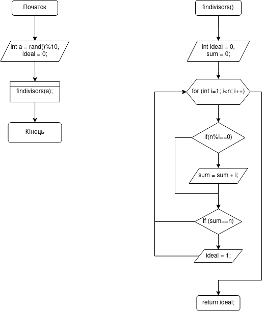
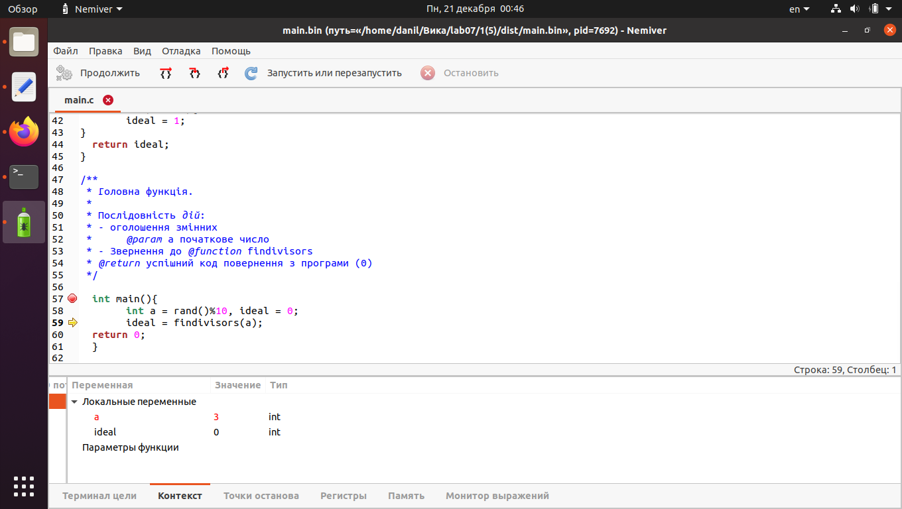

# Загальне завдання
1. Реалізувати програму відповідно до індивідуального завдання за допомогою трьох типів циклів.

#Індивідуальне завдання
1. **Визначити**, чи є задане число простим

**ВИКОНАННЯ РОБОТИ**
2.1 Функціональне призначення
	Програма призначена для визначення чи є задане число простим
2.2 Створення репозиторію
	Створивши репозиторій на github, клоную його та створюю всі файли за вимогами структури проекту. 
2.3 Написання коду програми
```
int findivisors(int n){
int ideal = 0, sum = 0;
	for (int i=1; i<n; i++){
	if(n%i==0){
	sum = sum + i;
	} else { continue;
	}
	}
	if (sum==n){
	ideal = 1;
}
  return ideal;
}
```
	


2.4 Компіляція проекту, та перевірка правильності роботи програми за допомогою Nemiver



Висновки:
Я створила програму, яка визначає чи є задане число простим
