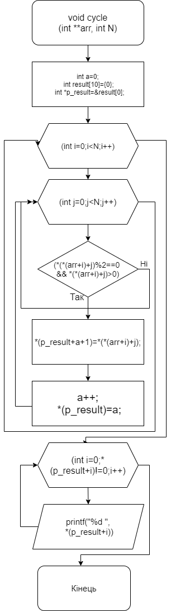
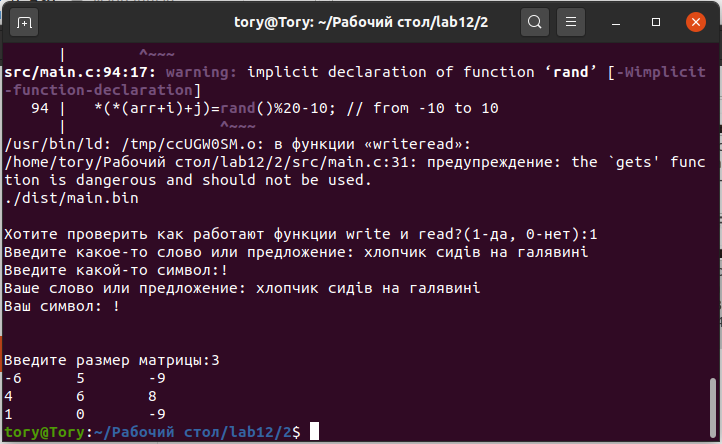

# Загальне завдання
1. Дано масив з N*N цілих чисел. У кожному рядку **знайти** кількість парних додатних чисел. Отримані результати записати в одновимірний масив. Використати функції введення та виведення.
 
 **ВИКОНАННЯ РОБОТИ**
2.1 Функціональне призначення:
	Програма призначена для визначення та підрахунку парних додатніх чисел.
2.2 Використання функції вводу та виводу:
	У программі використовуються такі функції, як printf(), scanf(), gets(), puts(), getc(), putc() та write(), read().
2.3 Написання коду програми:
```
void writeread(){
char massword[50]="";
	char word="";
	printf("");
	gets(massword);
	printf("Введите какое-то слово или предложение: ");
	gets(massword);
	printf("Введите какой-то символ:");
	word=getc(stdin);
	printf("Ваше слово или предложение: ");
	puts(massword);
	printf("Ваш символ: ");
	putc(word,stdout);
	printf("\n");
	printf("\n");
}
```
	


2.4 Блок-схема до головної функції.



2.5 Результат виконання програми у консолі.

Висновок: під час виконання лабораторної роботи я закріпила навички використання функцій введення та виведення.
