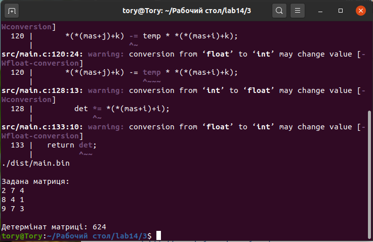

# Загальне завдання

1. Знайти детермінант матриці, якщо це можливо.
2. Використовувати взаємодію з файлом.
**ВИКОНАННЯ РОБОТИ**
3.1 Функціональне призначення:
	Програма призначена для визначення та підрахунку детермінанту матриці.
3.2 Написання коду програми:
```
int main()
{

  FILE *fp; //покажчик на файл
  fp = fopen("matr.txt", "a+"); //відкриваємо файл для читання

  int num1 = 0; //кількість рядків матриці
  int num2 = 0; //кількість стовбців матриці
  fscanf(fp, "%d %d", &num1, &num2);

  /*якщо матриця не квадратна, тоді програма завершується*/
  if(num1 != num2)
  {

    fclose(fp); //завершуємо роботу з файлом
    printf("\nError: детермінант матриці знайти неможливо\n\n");
    exit(1);
  /*інакше знаходимо детермінант матриці*/
  }else{

    int N = num1;
    int mas[size][size] = {0};

    determinant(mas, N, fp);
    fclose(fp); //завершуємо роботу з файлом

  }

  return 0;

}
```
	


2.4 Блок-схема до головної функції.



2.5 Результат виконання програми у консолі.

Висновок: під час виконання лабораторної роботи я закріпила навички взаємодії з файлом.
